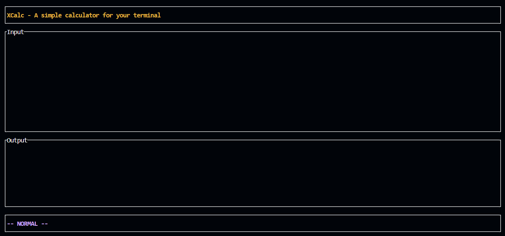

<p align="center">
  <h2 align="center">XCalc</h2>

  <p align="center">
    A Simple calculator for your terminal, written in Rust!
    <br/>
    <br/>
    <a href="https://github.com/tyroruyk/xcalc/issues">Report Bug</a>
    .
    <a href="https://github.com/tyroruyk/xcalc/issues">Request Feature</a>
  </p>
</p>

<br/>



### Installation
<!-- #### Requirements
* Rust (building from source)
```
cargo build
cargo run
``` -->
> Installer is not ready yet.

### Usage
<i>vim like usage</i>
* `i` - input mode
    * `enter` - calculate
* `esc` - normal mode
* `:` - command mode
    * `:c` - clear input & output
    * `:q` - quit

### Disclaimer
> This project is still <b>under development</b>. If you get any kind of problem, you are welcome to create an [issue!](https://github.com/tyroryk/xcalc/issues)
